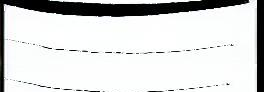
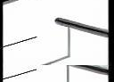
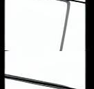
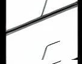
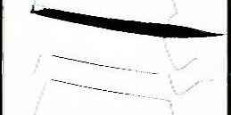
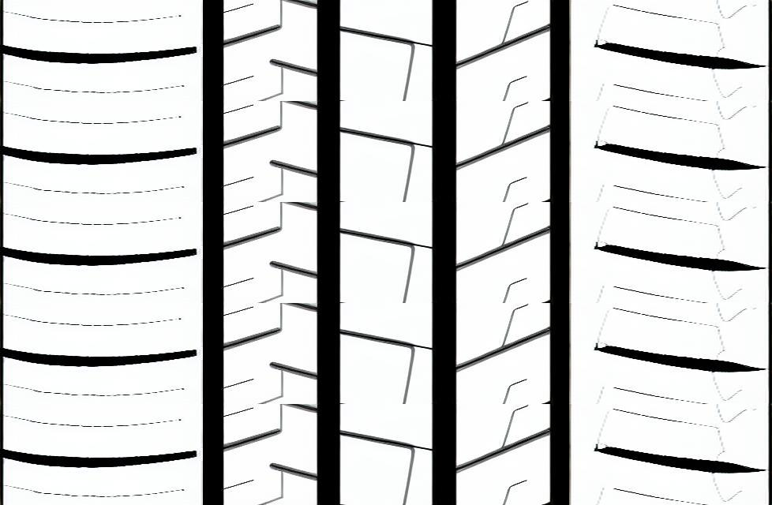

# 大图生成函数研发需求文档

## 1. 核心目标
实现一个函数，根据 `ImageLineage` 血缘信息，完成图片操作 → 多图拼接 → 装饰覆盖的完整流程，最终生成大图。

## 2. 算法流程图
```
输入: ImageLineage 对象
       │
       ▼ [RIB图片预处理]
┌─────────────────────────────────────────────┐
│ 遍历每个 RibSchemeImpl:                     │
│ 1. rib_image已存在? → 跳过                  │
│ 2. 解码 small_image (base64)                │
│ 3. 执行operations操作管道                   │
│ 4. 纵向重复 num_pitchs 次                   │
│ 5. resize(rib_width, rib_height)            │
│ 6. 编码为base64存入 rib_image               │
└─────────────────────────────────────────────┘
       │
       ▼ [主沟图片预处理]
┌─────────────────────────────────────────────┐
│ MainGrooveImpl处理:                         │
│ 1. after_image已存在? → 跳过                │
│ 2. 解码 before_image (base64)               │
│ 3. resize(groove_width, groove_height)      │
│ 4. 编码为base64存入 after_image             │
└─────────────────────────────────────────────┘
       │
       ▼ [装饰图片预处理]
┌─────────────────────────────────────────────┐
│ DecorationImpl处理:                         │
│ 1. after_image已存在? → 跳过                │
│ 2. 解码 before_image (base64)               │
│ 3. resize(decoration_width, decoration_height)│
│ 4. 应用 decoration_opacity 透明度           │
│ 5. 编码为base64存入 after_image             │
└─────────────────────────────────────────────┘
       │
       ▼ [参数验证]
┌─────────────────────────────────────────────┐
│ 验证规则:                                   │
│ - 所有图片高度一致                          │
│ - 装饰宽度 ≤ 总宽度/2                       │
│ - 必需字段存在                              │
│ - 尺寸参数有效                              │
└─────────────────────────────────────────────┘
       │
       ▼ [横向拼接]
┌─────────────────────────────────────────────┐
│ 按顺序拼接:                                 │
│ rib1 + groove + rib2 + groove + ... + ribN   │
└─────────────────────────────────────────────┘
       │
       ▼ [装饰覆盖]
┌─────────────────────────────────────────────┐
│ 在大图左右两侧各覆盖一个装饰图片            │
└─────────────────────────────────────────────┘
       │
       ▼ [返回结果]
输出: (更新后的 ImageLineage 对象, base64 大图)
```

## 2. 函数签名设计
```python
from typing import Tuple

def generate_large_image_from_lineage(
    lineage: ImageLineage,
    output_format: str = "png",
    is_debug: bool = False
) -> Tuple[ImageLineage, str]:
    """
    根据血缘信息生成大图
    
    Args:
        lineage: ImageLineage - 包含完整血缘信息的对象
        output_format: str - 输出格式，默认"png"
        is_debug: bool - 是否启用调试模式，默认False
    
    Returns:
        Tuple[ImageLineage, str] - (更新后的血缘对象, base64编码的大图)
    """
```

## 3. 详细处理流程

### 一、RIB图片操作处理
0. **跳过检查**：如果 `RibSchemeImpl.rib_image` 已有图像数据，直接跳过该RIB的所有操作
1. **输入处理**：每个 `RibSchemeImpl.small_image` 都是base64编码的单张图片，需要进行适当的图像处理
2. **执行操作管道**：按顺序执行 `operations` 元组中的所有操作（管道化执行）
3. **纵向重复**：将操作后的结果纵向重复 `RibSchemeImpl.num_pitchs` 次
4. **尺寸调整**：按照 `RibSchemeImpl.rib_height` 和 `RibSchemeImpl.rib_width` 进行resize
5. **结果保存**：将最终的base64图像数据保存到 `RibSchemeImpl.rib_image`
6. **循环处理**：继续处理下一个 `RibSchemeImpl`，直到所有RIB处理完成

### 二、主沟图片操作处理
0. **跳过检查**：如果 `MainGrooveImpl.after_image` 已有图像数据，直接跳过主沟操作（主沟只使用一张图）
1. **尺寸调整**：读取主沟花纹图片 `MainGrooveImpl.before_image`，按照 `MainGrooveImpl.groove_width` 和 `MainGrooveImpl.groove_height` 属性进行resize
2. **结果保存**：将处理后的base64图像数据保存到 `MainGrooveImpl.after_image`

### 三、装饰图片操作处理
0. **跳过检查**：如果 `DecorationImpl.after_image` 已有图像数据，直接跳过装饰操作（装饰只使用一张图）
1. **尺寸调整**：读取装饰花纹图片 `DecorationImpl.before_image`，按照 `DecorationImpl.decoration_width` 和 `DecorationImpl.decoration_height` 属性进行resize
2. **透明度处理**：根据 `decoration_opacity` 参数调整图像透明度
3. **结果保存**：将处理后的base64图像数据保存到 `DecorationImpl.after_image`

### 四、横向拼接处理
1. **拼接顺序**：按照 `rib1 + 主沟花纹 + rib2 + 主沟花纹 + ... + ribN` 的方式横向拼接所有图片

### 五、装饰覆盖处理
1. **双侧覆盖**：在拼接完成的大图左右两侧，各覆盖一个 `DecorationImpl.after_image`

### 〇、参数验证规则
- **高度一致性**：所有RIB图片、主沟图片、装饰图片的高度必须保持一致
- **装饰宽度限制**：装饰图片的宽度不应超过最终大图总宽度的1/2
- **必要字段检查**：确保所有必需的图像字段（small_image、before_image等）都已提供
- **尺寸有效性**：所有resize参数（rib_width/height、groove_width/height、decoration_width/height）必须为正整数

## 4. 技术选型决定
- **图像处理库**: 选择**PIL (Pillow)** 
  - 理由：操作相对简单，PIL足以满足所有需求；项目中已有使用；内存占用相对较小
  - 具体模块：`from PIL import Image, ImageOps`

## 5. 需求边界

✅ **本函数负责**：
- 执行RIB图片的各种原子操作
- 按顺序水平拼接处理后的RIB和主沟图片  
- 在大图两侧覆盖装饰花纹

❌ **本函数不负责**：
- 拼接方案的决策逻辑（由外部模板生成器处理）
- 血缘对象的验证和生成（由调用方保证）
- 复杂的布局计算（位置信息已由血缘数据提供）

## 6. 示例说明（可视化参考）

以 `rib_number=5`，无对称性要求的场景为例：

**输入RIB图片**：
- rib1:   
  (如无法显示，请查看: tests/datasets/stitching/rib1.png)
- rib2:   
  (如无法显示，请查看: tests/datasets/stitching/rib2.png)
- rib3:   
  (如无法显示，请查看: tests/datasets/stitching/rib3.png)
- rib4:   
  (如无法显示，请查看: tests/datasets/stitching/rib4.png)
- rib5:   
  (如无法显示，请查看: tests/datasets/stitching/rib5.png)

**预期输出大图**：
- bigimage:   
  (如无法显示，请查看: tests/datasets/stitching/except.png)

**处理流程**：
1. **RIB预处理**：对每个RIB执行操作管道 → 纵向重复num_pitchs次 → 按rib_width/height resize
2. **主沟预处理**：对主沟图片按groove_width/height resize（如果after_image不存在）
3. **装饰预处理**：对装饰图片按decoration_width/height resize并应用透明度（如果after_image不存在）
4. **参数验证**：检查所有图片高度一致、装饰宽度合规等
5. **横向拼接**：按rib1 + groove + rib2 + groove + ... + rib5的顺序拼接
6. **装饰覆盖**：在大图左右两侧各覆盖一个装饰图片
7. **输出结果**：返回 (更新后的ImageLineage对象, base64编码的大图)