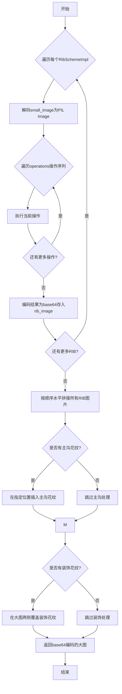

# 大图生成函数研发需求文档

## 1. 核心目标
实现一个函数，根据 `ImageLineage` 血缘信息，完成图片操作 → 多图拼接 → 装饰覆盖的完整流程，最终生成大图。

## 2. 算法流程图


## 2. 函数签名设计
```python
def generate_large_image_from_lineage(
    lineage: ImageLineage,
    output_format: str = "png"
) -> str:
    """
    根据血缘信息生成大图
    
    Args:
        lineage: ImageLineage - 包含完整血缘信息的对象
        output_format: str - 输出格式，默认"png"
    
    Returns:
        str - base64编码的大图
    """
```

## 3. 详细处理流程

### 阶段1：RIB图片操作处理（管道化执行）
- **核心逻辑**：对每个 `RibSchemeImpl` 对象，按顺序执行其 `operations` 元组中的所有操作
- **管道化实现**：
  - 操作序列是**有序执行**的管道
  - 前一个操作的输出直接作为后一个操作的输入
  - 所有操作都在内存中完成，不产生中间文件
  - 最终结果存储到 `rib_image` 字段

- **RibOperation操作实现**：
  - `NONE`: 直接使用原图
  - `FLIP_LR`: PIL的`Image.transpose(Image.FLIP_LEFT_RIGHT)`
  - `FLIP`: PIL的`Image.rotate(180)`
  - `LEFT_FLIP_LR`: 截取左半部分 → 左右翻转 → 拼接成完整图
  - `LEFT_FLIP`: 截取左半部分 → 旋转180度 → 拼接成完整图  
  - `RESIZE_HORIZONTAL_2X/1.5X/3X`: 横向拉伸对应倍数，保持纵向不变
  - `LEFT/RIGHT`: 截取左/右半部分
  - `LEFT_2_3/RIGHT_2_3`: 截取左/右2/3部分
  - `LEFT_1_3/RIGHT_1_3`: 截取左/右1/3部分
  - `__RESIZE_AS_FIRST_RIB`: 内部对齐操作，将当前图调整为第一张RIB的尺寸

### 阶段2：多图拼接处理
- **输入**: 处理后的RIB图片列表（按顺序）+ 主沟花纹图片列表
- **处理逻辑**: 
  - 按照`ribs_scheme_implementation`列表的顺序，依次水平拼接RIB图片
  - 在指定位置插入主沟花纹（根据业务逻辑确定插入点）
  - 由于拼接模板已在外部处理完成，本函数只需按给定顺序执行简单拼接

### 阶段3：装饰覆盖处理
- **装饰定位逻辑**：
  - 装饰花纹覆盖在拼接完成的大图**两侧**
  - 根据`decoration_width`确定覆盖区域宽度
  - 左侧装饰覆盖在大图最左侧，右侧装饰覆盖在大图最右侧
  - 使用PIL的alpha_composite进行透明度混合，透明度值为`decoration_opacity`(0-255)

## 4. 技术选型决定
- **图像处理库**: 选择**PIL (Pillow)** 
  - 理由：操作相对简单，PIL足以满足所有需求；项目中已有使用；内存占用相对较小
  - 具体模块：`from PIL import Image, ImageOps`

## 5. 需求边界

✅ **本函数负责**：
- 执行RIB图片的各种原子操作
- 按顺序水平拼接处理后的RIB和主沟图片  
- 在大图两侧覆盖装饰花纹

❌ **本函数不负责**：
- 拼接方案的决策逻辑（由外部模板生成器处理）
- 血缘对象的验证和生成（由调用方保证）
- 复杂的布局计算（位置信息已由血缘数据提供）

## 6. 示例说明（可视化参考）

以 `rib_number=5`，无对称性要求的场景为例：

**输入RIB图片**：
- rib1:   
  (如无法显示，请查看: tests/datasets/stitching/rib1.png)
- rib2:   
  (如无法显示，请查看: tests/datasets/stitching/rib2.png)
- rib3:   
  (如无法显示，请查看: tests/datasets/stitching/rib3.png)
- rib4:   
  (如无法显示，请查看: tests/datasets/stitching/rib4.png)
- rib5:   
  (如无法显示，请查看: tests/datasets/stitching/rib5.png)

**预期输出大图**：
- bigimage:   
  (如无法显示，请查看: tests/datasets/stitching/except.png)

**处理流程**：
1. 每个RIB可能经过不同的操作序列处理（本例中无特殊操作）
2. 按rib1→rib2→rib3→rib4→rib5的顺序水平拼接
3. 如果有主沟花纹，在指定位置插入
4. 如果有装饰花纹，在大图两侧覆盖
5. 最终生成完整的轮胎花纹大图